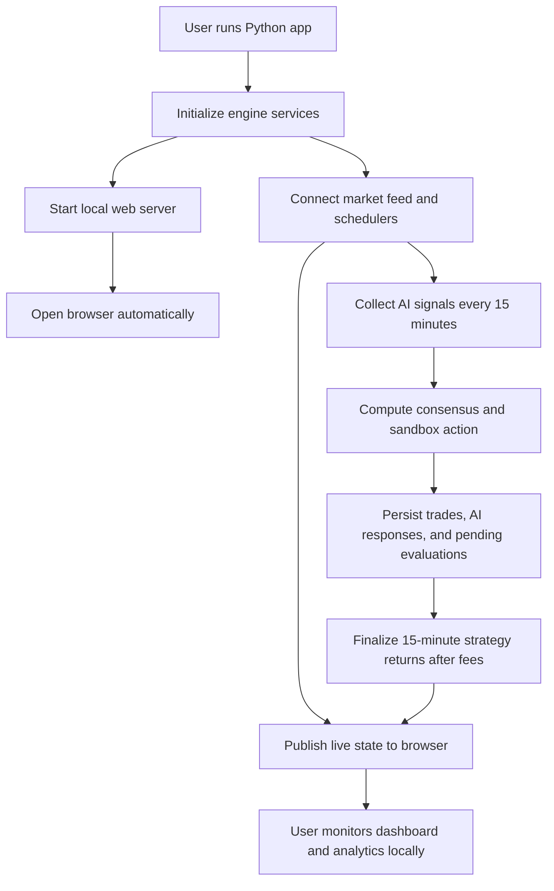

## 1. Product Overview
Desktop-first local trading control room for the BTC sandbox runner, launched by one Python command that starts the engine, serves a browser dashboard, and opens the page automatically.
- Replaces the flickering terminal UI with a stable real-time web interface while preserving the existing sandbox logic, model voting, CSV history, and Hyperliquid-based market workflow.
- Targets a single desktop operator who needs faster visual clarity, smoother live updates, and easier comparison of model performance over time.

## 2. Core Features

### 2.1 Feature Module
1. **Live Dashboard**: quote strip, feed health, countdown, account metrics, open position, model votes, recent trades, action log.
2. **Strategy Analytics**: 15-minute per-model return table, cumulative comparison, CSV-backed history browser.
3. **Local App Shell**: one-command launch, auto-open browser, graceful startup checks, engine/server status.

### 2.2 Page Details
| Page Name | Module Name | Feature description |
|-----------|-------------|---------------------|
| Live Dashboard | Quote strip | Shows BTC bid, ask, mid, spread, and feed freshness with clear status colors. |
| Live Dashboard | Account summary | Shows available balance, equity, live PnL, current position, next 15-minute cycle, and risk settings. |
| Live Dashboard | Open position | Shows side, entry, current mark, gain percent, unrealized PnL, and elapsed time. |
| Live Dashboard | Model panel | Shows Gemini, OpenAI, Claude, Perplexity, Grok, and consensus outputs with rationale snippets and timing metadata. |
| Live Dashboard | Recent trades | Shows entry/exit price, entry/exit USD, raw PnL, fees, final PnL, and reason. |
| Live Dashboard | Action log | Streams the latest operational logs without repainting the full screen. |
| Strategy Analytics | Strategy return table | Lists one completed 15-minute window per row with numeric return columns for all five models plus consensus. |
| Strategy Analytics | Comparison summary | Shows cumulative return totals, best/worst strategy, and per-strategy count of long, short, and no-trade calls. |
| Strategy Analytics | Export/source links | Gives direct links or buttons to open the underlying CSV files and copy local paths. |
| Local App Shell | Startup flow | Python script initializes engine, verifies server readiness, opens the browser automatically, and prints the local URL. |
| Local App Shell | Resilience | If the browser cannot open, the app keeps running and prints the fallback URL; if the engine restarts, the UI reconnects automatically. |

## 3. Core Process
1. User runs a single Python script from the desktop.
2. The script initializes market feed workers, state store, persistence, AI scheduler, and local web server.
3. Once the server is ready, the app opens the default browser to the local dashboard URL.
4. The dashboard subscribes to live state updates and renders quotes, account state, model votes, and logs without full-screen flicker.
5. Every 15 minutes the engine captures the current market snapshot, requests all five AI model signals, computes consensus, and executes the sandbox position logic.
6. After each 15-minute window closes, the app records per-model and consensus returns after fees and exposes updated analytics in the browser.
7. CSV logs and state files persist across restarts so the browser view resumes from prior history.

## 4. User Interface Design
### 4.1 Design Style
- Primary colors: deep charcoal, graphite, warm off-black, electric cyan accents, vivid green/red for PnL, muted gold for fees and status highlights.
- Button style: flat industrial controls with subtle bevels, thin borders, dense spacing, and strong hover contrast.
- Fonts and sizes: desktop-first editorial mono + neo-grotesk pairing; high-contrast numeric font treatment for prices and PnL.
- Layout style: dense operator console with a fixed top quote strip, two-column dashboard body, and tabbed analytics.
- Icon style suggestions: restrained line icons, exchange-terminal cues, small directional arrows, and minimal badges rather than emoji.

### 4.2 Page Design Overview
| Page Name | Module Name | UI Elements |
|-----------|-------------|-------------|
| Live Dashboard | Quote strip | Sticky top rail, bold numeric quote tiles, spread badge, feed freshness dot, subtle pulse on changes. |
| Live Dashboard | Account summary | Compact metric cards with large numeric readouts, strong red/green contrast, and micro-labels. |
| Live Dashboard | Model panel | Six aligned strategy cards, vote direction chips, rationale previews, elapsed request time, and consensus prominence. |
| Live Dashboard | Recent trades | Wide data table with sticky header, color-coded PnL columns, fee highlight, and monospace price values. |
| Strategy Analytics | Return table | Scrollable comparison table, right-aligned numeric columns, cumulative footer row, and optional column emphasis on hover. |
| Strategy Analytics | Comparison summary | Summary strip with cumulative totals, leader badge, and sparkline-ready placeholder region. |
| Local App Shell | Startup/empty states | Ready banner, fallback URL text, connection retries, and clear “engine warming up” messaging. |

### 4.3 Responsiveness
- Desktop-first layout is required and optimized for full-width monitors.
- Tablet support should preserve readability but may stack lower-priority panels.
- Mobile can degrade to read-only status panels and tables with horizontal scrolling; mobile is not the primary operating mode.

