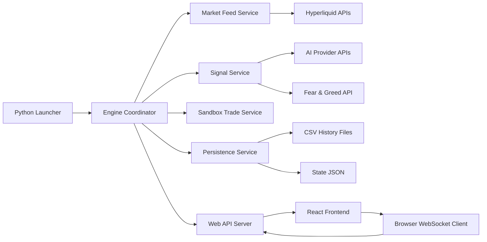
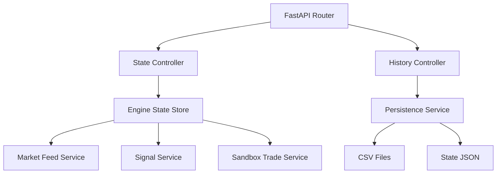
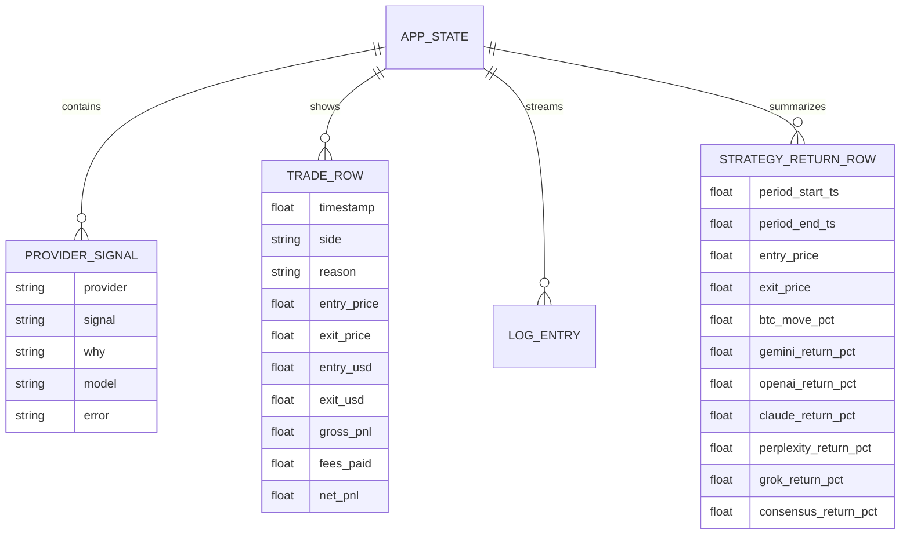

## 1. Architecture Design


## 2. Technology Description
- Frontend: React@18 + Tailwind CSS@3 + Vite, desktop-first local dashboard.
- Initialization Tool: Vite.
- Backend: FastAPI + Uvicorn for HTTP routes, WebSocket updates, and local browser launch coordination.
- Engine runtime: Python standard-library-first services plus existing `websocket-client` usage for Hyperliquid streaming.
- Data storage: existing CSV files and JSON state files; no external database required.
- External services: Hyperliquid market APIs, five AI provider APIs, Fear & Greed API.

## 3. Route Definitions
| Route | Purpose |
|-------|---------|
| / | Main live dashboard with quotes, account state, model signals, trades, and logs |
| /analytics | Strategy analytics view with per-window returns and cumulative comparison |
| /api/state | Returns current engine state snapshot for initial page hydration |
| /api/trades | Returns recent trades from memory or CSV history |
| /api/strategy-returns | Returns completed 15-minute strategy return rows |
| /api/ai-responses | Returns recent AI decision history for deeper inspection |
| /ws/state | WebSocket endpoint for live state and incremental updates |

## 4. API Definitions
```ts
type SignalValue = "LONG" | "SHORT" | "NO_TRADE" | "PENDING";

interface QuoteState {
  bid: number;
  ask: number;
  mid: number;
  spreadBps: number;
  lastTickAt: number;
  lastBookAt: number;
  feedLabel: string;
}

interface ProviderSignal {
  provider: "gemini" | "openai" | "claude" | "perplexity" | "grok" | "consensus";
  signal: SignalValue;
  why: string;
  model?: string;
  error?: string;
}

interface TradeRow {
  timestamp: number;
  side: "LONG" | "SHORT";
  reason: string;
  entryPrice: number;
  exitPrice: number;
  entryUsd: number;
  exitUsd: number;
  grossPnl: number;
  feesPaid: number;
  netPnl: number;
  secondsOpen: number;
}

interface StrategyReturnRow {
  periodStartTs: number;
  periodEndTs: number;
  entryPrice: number;
  exitPrice: number;
  btcMovePct: number;
  roundTripFeePct: number;
  geminiSignal: SignalValue;
  geminiReturnPct: number;
  openaiSignal: SignalValue;
  openaiReturnPct: number;
  claudeSignal: SignalValue;
  claudeReturnPct: number;
  perplexitySignal: SignalValue;
  perplexityReturnPct: number;
  grokSignal: SignalValue;
  grokReturnPct: number;
  consensusSignal: SignalValue;
  consensusReturnPct: number;
}

interface AppStateResponse {
  quotes: QuoteState;
  available: number;
  equity: number;
  livePnl: number;
  position: Record<string, unknown> | null;
  nextSignalAt: number;
  lastSignal: SignalValue;
  providers: ProviderSignal[];
  trades: TradeRow[];
  logs: string[];
}
```

## 5. Server Architecture Diagram


## 6. Data Model
### 6.1 Data Model Definition


### 6.2 Data Definition Language
```sql
-- CSV-backed logical schemas retained; no external database required.
-- strategy_returns.csv
period_start_utc TEXT,
period_start_ts REAL,
period_end_utc TEXT,
period_end_ts REAL,
entry_price REAL,
exit_price REAL,
btc_move_pct REAL,
round_trip_fee_pct REAL,
gemini_signal TEXT,
gemini_return_pct REAL,
openai_signal TEXT,
openai_return_pct REAL,
claude_signal TEXT,
claude_return_pct REAL,
perplexity_signal TEXT,
perplexity_return_pct REAL,
grok_signal TEXT,
grok_return_pct REAL,
consensus_signal TEXT,
consensus_return_pct REAL;

-- trades.csv and ai_responses.csv remain append-only and are exposed through API adapters.
```

